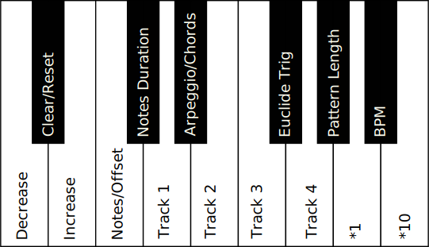

# Euclide4TracksJammer

Rudimentary MIDI multitrack with Euclidean rhythm generation on [RK-002](https://www.retrokits.com/rk002/ "Retrokits RK-002's Homepage")

## Description

 * Each track contains max 16 notes.
 * Each track can have a different length (pattern of 16 steps by default).
 * An offset can be added to each track.
 * Each note is triggered according to a Euclidean rhythm defined by track (by defining the number of trigs)
 * Each track can be played in arpeggio mode (one note per trig) or in chord mode (all notes are played at each trig)
 * The duration of the notes can be generated by following one of the 5 choices [Same duration of a step, Fixed Random, Live Random, NumberOfStep / NumberOfHit, NumberOfStep / (NumberOfHit * 2)]
 * For now, it only uses an internal clock.
 * The BPM is 120 by default, could be increased / decreased by 1 or 10.
 * It uses midi channel 1.
  
 ## User interface:
 
 | Note  | Action                       |
 | :---: | :--------------------------- |
 | `A 0` | [-] **decrease** key         |
 | `A#0` | **Clear**/**Reset**          |
 | `B 0` | [+] **increase** key         |
 | `C 1` | **Note**/**Offset** Mode     |
 | `C#1` | **Note Duration** Mode       |
 | `D 1` | **Track 1** selection        |
 | `D#1` | **Arpeggio**/**chords** Mode |
 | `E 1` | **Track 2** selection        |
 | `F 1` | **Track 3** selection        |
 | `F#1` | **Euclide Trig** Mode        |
 | `G 1` | **Track 4** selection        |
 | `G#1` | **Pattern Length** Mode      |
 | `A 1` | Factor **1** option          |
 | `A#1` | **BPM** Mode                 |
 | `B 1` | Factor **10** option         |

 

 The general operation is as follows: 
    
  Select a **Track**, then a **Mode** and **modify** (increase or decrease) its value.

 ## Example of key combination:
 - Delete the notes of a track:

    ([`D1`] or [`E1`] or [`F1`] or [`G1`]) + [`C1`] + [`A#0`]

 - Add an offset in a track:

    ([`D1`] or [`E1`] or [`F1`] or [`G1`]) + [`C1`] + [`B0`]

 - Change the generation mode of the note duration:

    ([`D1`] or [`E1`] or [`F1`] or [`G1`]) + [`C#1`] + [`A#0`]
  
 ## Example of use:
 
   1. Press and hold D1 to select Track 1
   2. While holding D1, enter few notes, they are now recorded in track 1
   3. Then press and hold D1 and F#1 (to enter Euclide Mode for the Track 1) 
   4. While holding those keys, set the number of hit for the pattern by pressing B0.
   5. The sequence will begin to play the entered notes when you let go. 

